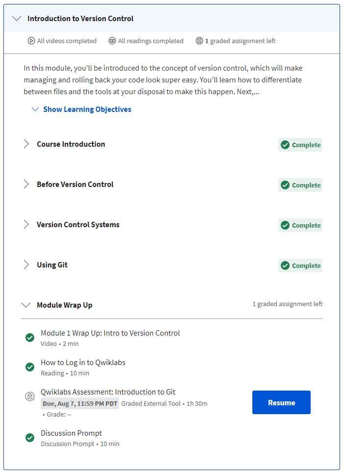
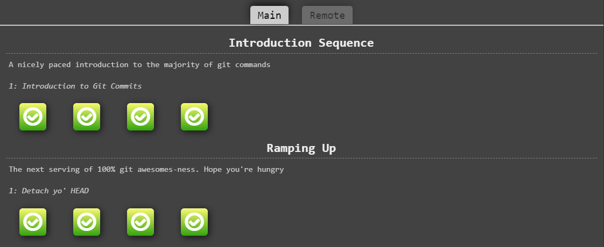
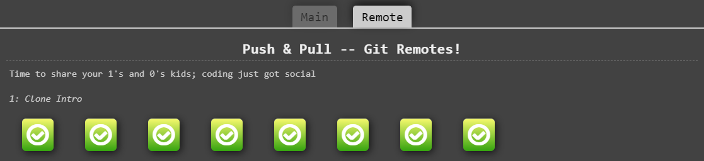

# kottans-frontend progress list

## 0. Git Basics

[Introduction to Git and GitHub](https://www.coursera.org/learn/introduction-git-github)

Week 1

Week 2

>

[Learn Git Branching](https://learngitbranching.js.org/)

Introduction Sequence, Ramping Up

Push & Pull

