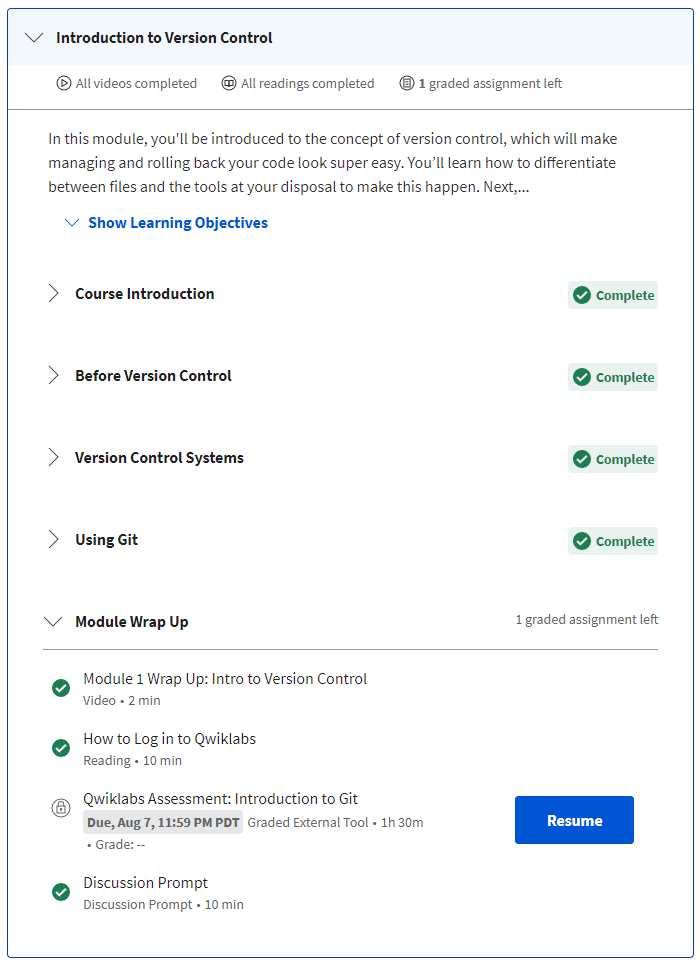
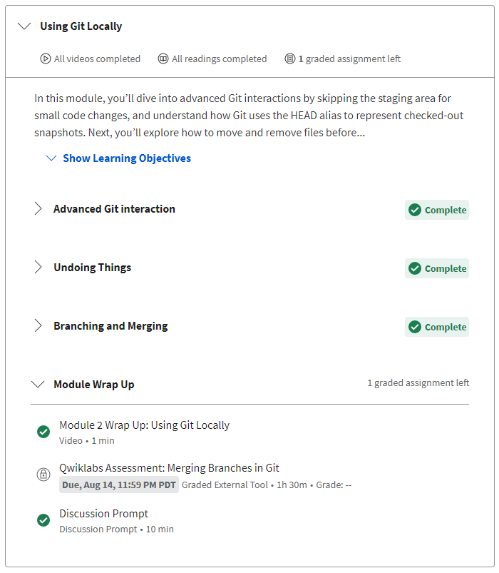
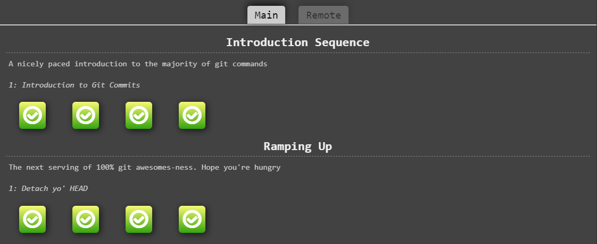
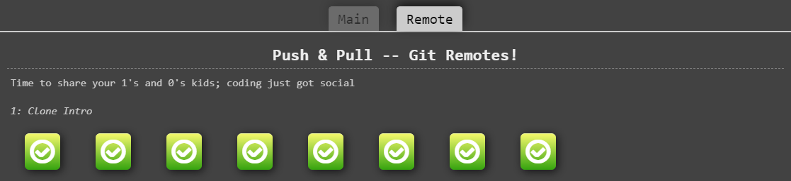
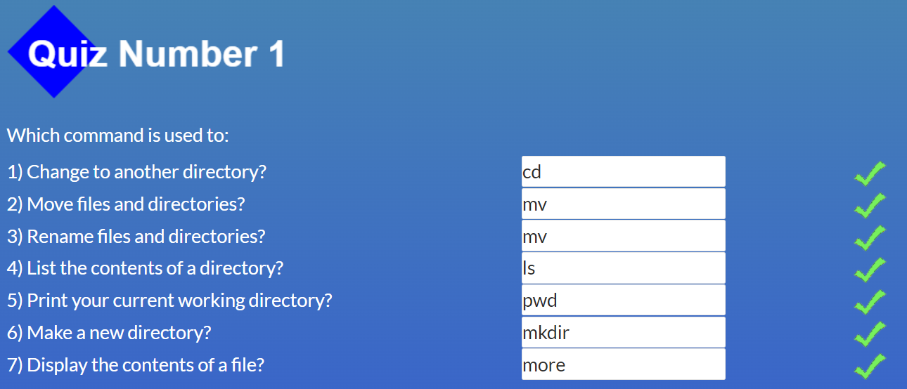
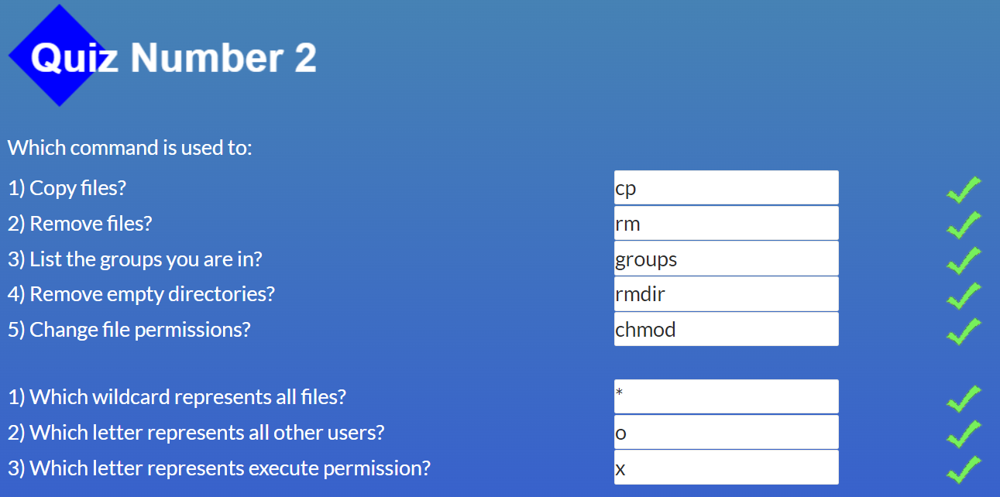
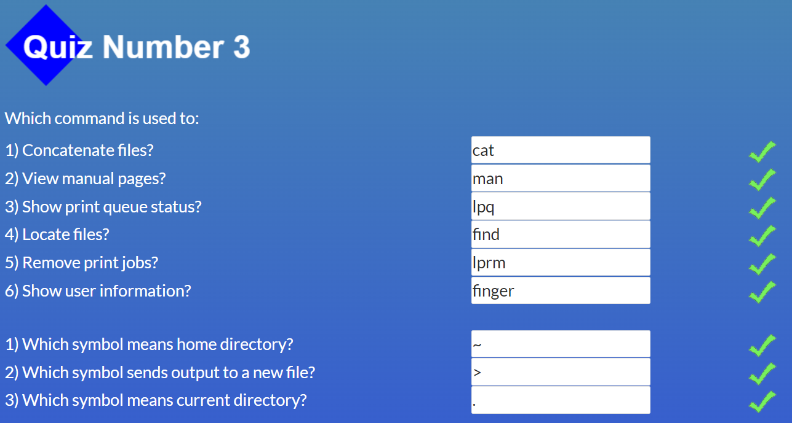
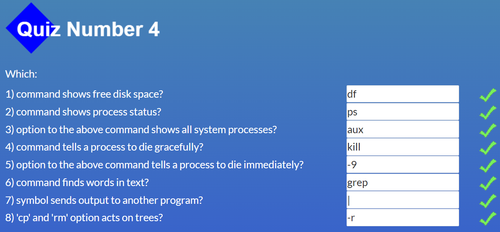

## 0. Git Basics

[Introduction to Git and GitHub](https://www.coursera.org/learn/introduction-git-github)

Week 1

Week 2

>

[Learn Git Branching](https://learngitbranching.js.org/)

Introduction Sequence, Ramping Up

Push & Pull

## 1. Linux CLI, and HTTP

[Linux Survival (4 modules)](https://linuxsurvival.com/)

Module 1

Module 2

Module 3

Module 4

