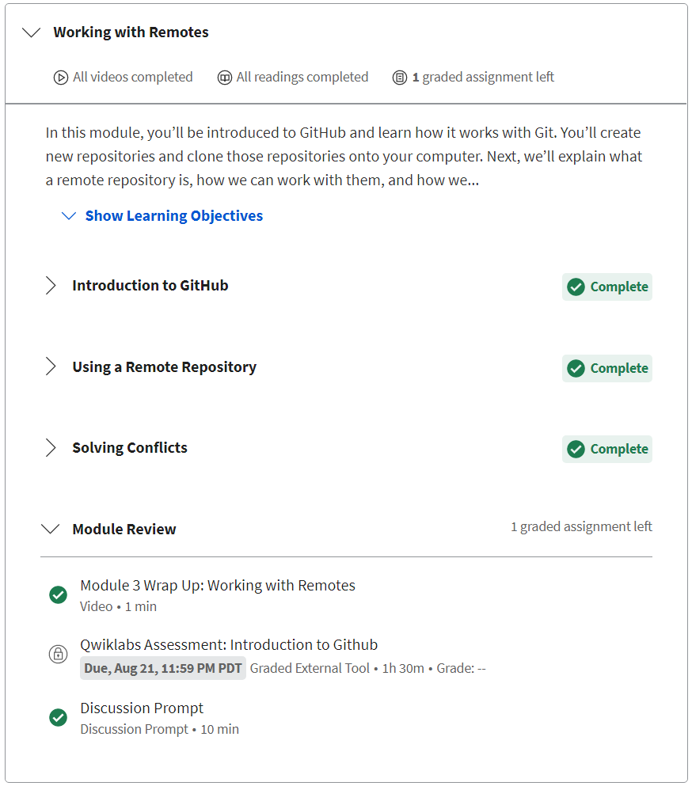
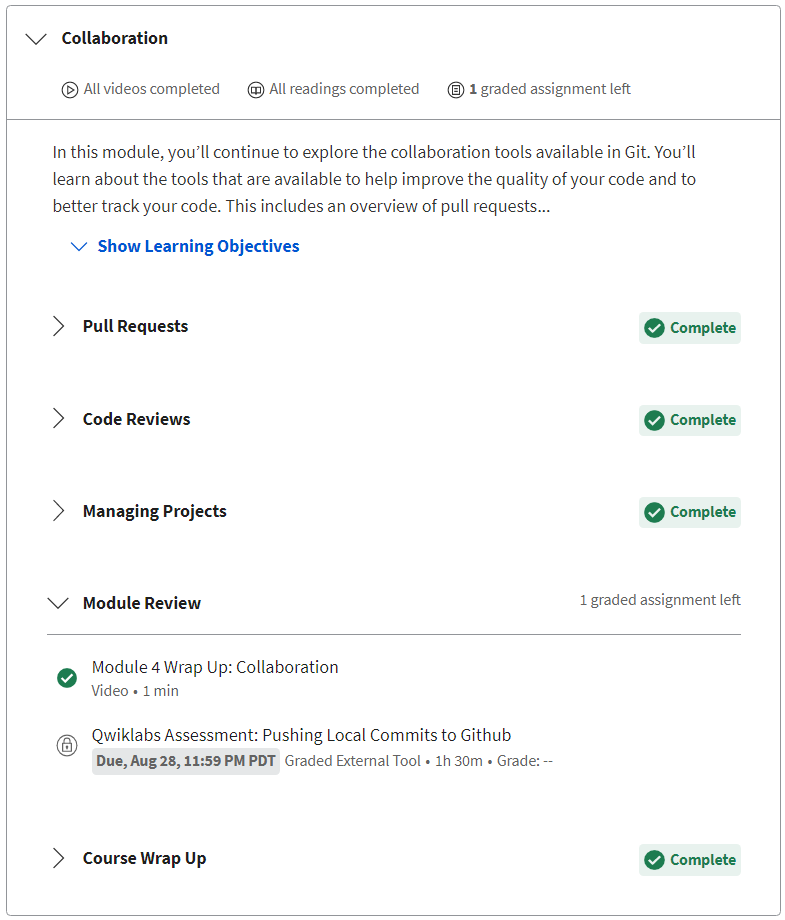
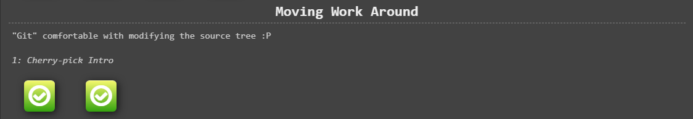
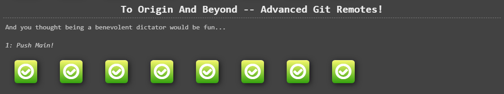
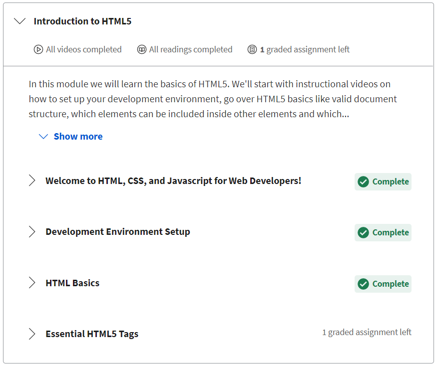
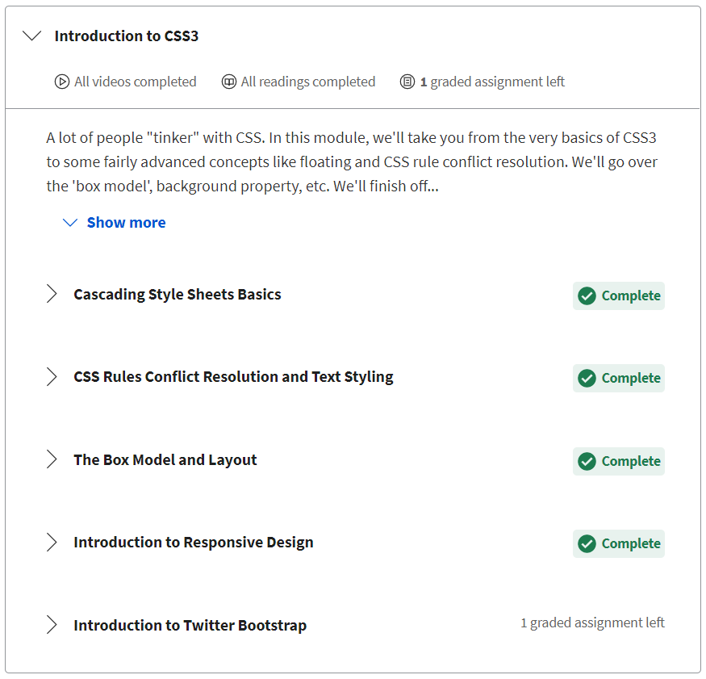
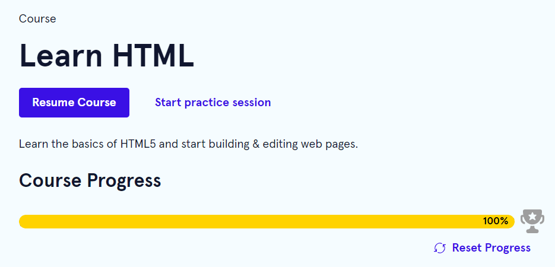
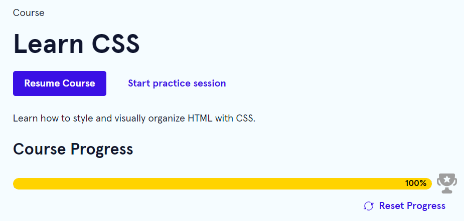

## 0. Git Basics

[Introduction to Git and GitHub](https://www.coursera.org/learn/introduction-git-github)

Week 1

Week 2

>

[Learn Git Branching](https://learngitbranching.js.org/)

Introduction Sequence, Ramping Up

Push & Pull

## 1. Linux CLI, and HTTP

[Linux Survival (4 modules)](https://linuxsurvival.com/)

Module 1

Module 2

Module 3

Module 4

## 2. Git Collaboration

[Introduction to Git and GitHub](https://www.coursera.org/learn/introduction-git-github)

Week 3

Week 4

>

[Learn Git Branching](https://learngitbranching.js.org/)

Moving Work Around

To Origin And Beyond -- Advanced Git Remotes!

## 3. Intro to HTML and CSS

[HTML, CSS, and Javascript for Web Developers](https://www.coursera.org/learn/html-css-javascript-for-web-developers)

Week 1

Week 2

>

[Learn HTML](https://www.codecademy.com/learn/learn-html)

Learn HTML

>

[Learn CSS](https://www.codecademy.com/learn/learn-css)

Learn CSS

